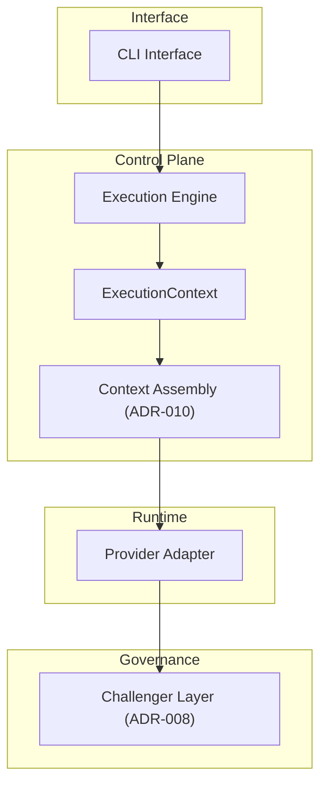

# IO‑III Architecture

IO‑III is a **governance‑first LLM control‑plane architecture** designed for **deterministic, bounded execution of local language models**.

Unlike feature‑driven AI frameworks, IO‑III focuses on **structural guarantees**:

- deterministic routing
- bounded execution
- explicit audit gates
- invariant‑protected runtime behaviour
- architecture‑first governance

The repository contains:

1. a formal architecture specification layer (ADRs, invariants, contracts, governance rules)
2. a minimal reference implementation of the runtime control plane

The project intentionally prioritises **architectural clarity and deterministic system design** over rapid feature expansion.

---

# Architecture Quick Start

IO‑III implements a **deterministic local LLM control plane** designed around governance and bounded execution.

Core runtime structure:

CLI  
↓  
Execution Engine  
↓  
ExecutionContext  
↓  
Context Assembly (ADR‑010)  
↓  
Provider  
↓  
Challenger (optional)

Key guarantees enforced by the architecture:
- deterministic routing
- bounded audit passes
- bounded revision passes
- invariant‑protected runtime behaviour
- governance‑first system evolution

Primary architecture documentation:
docs/overview/ → system overview and roadmap  
docs/architecture/ → architecture definitions  
ADR/ → architectural decision records

## Quick Run Example

The reference runtime can be executed locally through the CLI.

Example command:
```python
python -m io\_iii run executor --prompt "Explain deterministic routing in one sentence."
```
Expected behaviour:
\- the CLI loads runtime configuration
\- deterministic routing selects the provider
\- the execution engine runs the prompt pipeline
\- the challenger may optionally audit the output (if enabled)\

### Architecture Validation

The repository also includes validation tools for architectural guarantees.

Run the invariant validator:
```python
python architecture/runtime/scripts/validate\_invariants.py
```
Run the regression test suite:
```python
pytest
```
These commands verify that the system still satisfies its **core architectural invariants**.

---

# Runtime Architecture



The runtime implements a **deterministic execution pipeline** with explicit architectural boundaries between interface, control plane, runtime providers, and governance layers.

---

# Design Intent

IO‑III is engineered under strict architectural constraints:
- deterministic routing
- bounded execution
- no recursion loops
- no unbounded chains
- governance before feature expansion
- local‑first architecture
- contract + invariant enforcement as stability mechanisms

Structural integrity is prioritised over capability growth.

---

# Governance Model (ADR‑First)

All structural changes follow an **ADR‑first development model**.

Any modification affecting:

- control‑plane design
- routing logic or fallback policy
- provider or model selection
- audit gate behaviour
- persona binding or runtime governance
- memory or persistence layers
- cross‑model interaction

requires a new architecture decision record inside:

`ADR/`

before implementation changes occur.

This repository therefore functions as the **source of truth for IO‑III architectural boundaries**.

---

# Documentation Structure

The documentation follows a structured classification system.

DOC‑OVW → system overview documents  
DOC‑ARCH → architecture definitions  
DOC‑IMPL → implementation documentation  
DOC‑RUN → runtime configuration documentation  
DOC‑GOV → governance documentation  
ADR → architectural decision records

Primary entry points:
docs/overview/DOC‑OVW‑001‑architecture‑overview‑index.md  
docs/architecture/DOC‑ARCH‑001‑runtime‑architecture.md

---

# Repository Layout

ADR/ → architecture decision records

docs/  
  overview/ → high‑level system documentation  
  architecture/ → architecture definitions  

architecture/  
  runtime/  
    config/ → canonical runtime configuration  
    tests/ → invariant fixtures  
    scripts/ → invariant validator  

io_iii/ → reference runtime implementation  
  core/ → engine components  
  providers/ → provider adapters  
  routing.py → deterministic routing  
  cli.py → CLI interface  

---

# Control‑Plane Reference Implementation

The repository includes a **minimal Python implementation of the IO‑III control plane**.

Core modules:

io_iii/
| Module | Responsibility |
|------|----------------|
| config.py | runtime config loading |
| routing.py | deterministic route resolution |
| core/engine.py | execution engine |
| core/context_assembly.py | context assembly (ADR‑010) |
| core/session_state.py | control‑plane state container |
| core/execution_context.py | engine‑local runtime container |
| providers/null_provider.py | null provider adapter |
| providers/ollama_provider.py | Ollama provider adapter |
| cli.py | CLI entrypoint |

Execution path:

CLI → Engine.run() → ExecutionContext → Context Assembly → Provider → Challenger (optional)

This layering guarantees **single‑path deterministic execution**.

---

# Invariant Suite

Architectural guarantees are protected by invariant fixtures.

Location:
architecture/runtime/tests/invariants/

Validator:
architecture/runtime/scripts/validate_invariants.py

These enforce properties such as:
- routing table integrity
- cloud providers disabled by default
- logging defaults (metadata‑only)

---

# Regression Enforcement

Critical execution guarantees are protected by regression tests.

Example:
tests/test_audit_gate_contract.py

This test ensures the **audit gate contract remains bounded**.

---

# Core Invariants

IO‑III enforces the following system‑level guarantees:
- deterministic routing only
- challenger enforcement internal to the engine
- audit execution explicitly user‑toggled
- bounded audit passes (MAX_AUDIT_PASSES = 1)
- bounded revision passes (MAX_REVISION_PASSES = 1)
- no recursion loops
- no multi‑pass execution chains
- single unified final output

These are treated as **contract‑level invariants**.

---

# Non‑Goals (Intentional Constraints)

The project intentionally does **not** implement:
- persistent memory
- retrieval systems (RAG / embeddings)
- autonomous planning
- agent loops
- model arbitration beyond deterministic routing
- streaming execution
- automatic audit policies

Future expansion must preserve:
- deterministic control‑plane execution
- bounded runtime guarantees
- invariant enforcement

---

# Milestones

### Phase 1 — Control Plane Stabilisation

- deterministic routing
- challenger enforcement (ADR‑008)
- bounded audit gate contract (ADR‑009)
- invariant validation suite
- regression enforcement

### Phase 2 — Structural Consolidation

- SessionState v0 implemented
- execution engine extracted
- CLI → engine boundary established
- context assembly integrated (ADR‑010)
- ExecutionContext introduced
- challenger ownership consolidated inside the engine
- provider injection seams implemented
- tests passing (pytest)
- invariant validator passing

### Phase 3 — Capability Layer (Planned)

Phase 3 introduces additional **engine‑local capability boundaries** while preserving deterministic execution.

Planned work includes:
- expanding provider abstraction contracts
- strengthening dependency‑injection seams
- defining capability interfaces inside the execution engine

No autonomous behaviour or dynamic routing will be introduced.

---

# What This Project Demonstrates

IO‑III is an architecture‑focused LLM project rather than a feature‑driven AI tool.

The repository demonstrates:
- systems architecture thinking
- deterministic runtime design
- governance‑driven engineering (ADR‑first development)
- invariant‑protected architecture
- bounded execution guarantees for LLM systems
- separation between control plane and runtime providers

The project intentionally prioritises **structural integrity and architectural guarantees** over rapid feature expansion.

---

# Project Status

Phase 1 — Control Plane Stabilised  
Phase 2 — Structural Consolidation Complete  
Phase 3 — Capability Layer (Next)

IO‑III prioritises **determinism, governance discipline, and architectural clarity** over feature velocity.
