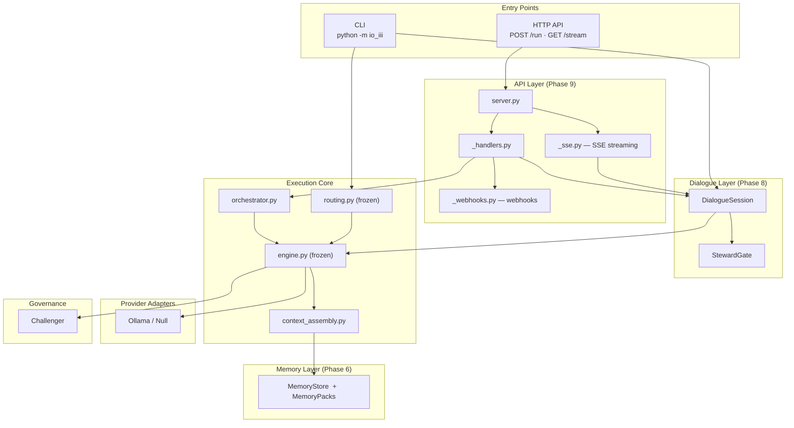

# Io³ — Deterministic AI Runtime

Most AI tooling is permissive by default: you send a prompt, you get a response, and the model decides the rest. Io³ is built the other way around. Every request passes through explicit routing, hard execution limits, and structural content boundaries before anything reaches the model, and before any output reaches you. The result is a runtime that knows what it will not do, and enforces that in code rather than in documentation.

**For engineers:** Io³ is a local, provider-agnostic LLM control plane. Deterministic routing, bounded orchestration, governed dialogue sessions, a content-safe HTTP API, and a steward supervision layer. The execution engine, routing layer, and telemetry are frozen after Phase 1; subsequent phases add surface area without modifying the core.

**For senior architects:** A deterministic LLM control plane with a frozen execution core, ADR-governed structural change, content-safe telemetry, and bounded orchestration semantics. All governance is code-enforced, not conventional. 26 Architecture Decision Records. 1182+ passing tests.

---

## What Io³ enforces

- **Deterministic routing**: every request resolves to exactly one provider via a static routing table; no dynamic model selection
- **Bounded execution**: hard limits on audit passes (1), revision passes (1), capability invocations, and session turn counts
- **Content-safe output**: prompts, model completions, and memory values never appear in logs, metadata, or API responses
- **ADR-first development**: every structural change requires an Architecture Decision Record before implementation begins
- **Frozen core**: `routing.py`, `engine.py`, and `telemetry.py` do not change after Phase 1
- **Steward supervision**: sessions run in work mode (autonomous) or steward mode (human approval required at configurable gates)

---

## Quick start

**Prerequisites:** [Ollama](https://ollama.com) running locally with at least one model pulled. Python 3.11+.

```bash
git clone https://github.com/CevenJKnowles/io-architecture.git
cd io-architecture
python -m venv .venv
source .venv/bin/activate
pip install -e ".[dev]"
```

**Single run:**

```bash
python -m io_iii run executor --prompt "Explain deterministic routing in one sentence."
```

**Multi-turn session:**

```bash
python -m io_iii session start --mode work
python -m io_iii session continue --session-id <uuid> --prompt "Next question."
```

**Web UI:**

```bash
python -m io_iii serve   # binds to 127.0.0.1:8080
```

Enable model output in `architecture/runtime/config/runtime.yaml`: `content_release: true` (ADR-026).

For model configuration, error reference, and all modes: [docs/user-guide/GETTING_STARTED.md](docs/user-guide/GETTING_STARTED.md).

---

## System architecture



---

## Non-goals

Io³ is explicitly not an agent framework, autonomous reasoning pipeline, dynamic tool orchestrator, retrieval or embedding system, multi-model arbitration system, or cloud deployment platform. These exclusions are structural: each is governed by an ADR.

---

## Documentation

| | |
|---|---|
| Getting started | [docs/user-guide/GETTING_STARTED.md](docs/user-guide/GETTING_STARTED.md) |
| Why Io³ exists | [docs/user-guide/WHY-IO3.md](docs/user-guide/WHY-IO3.md) |
| Model configuration | [docs/user-guide/MODELS.md](docs/user-guide/MODELS.md) |
| Architecture decision records | [ADR/](ADR/) |
| Worked examples | [examples/](examples/) |
| Changelog | [CHANGELOG.md](CHANGELOG.md) |
| Contributing | [CONTRIBUTING.md](CONTRIBUTING.md) |

Architecture docs live under `docs/` (overview, architecture, governance, runtime). Primary entry point: `docs/overview/DOC-OVW-001-architecture-overview-index.md`.

---

## Project status

Phase 10 in progress. Latest stable tag: `v0.9.0`. Nine complete phases. 26 Architecture Decision Records. MIT licence.

See [CHANGELOG.md](CHANGELOG.md) for the full phase-by-phase milestone history.
