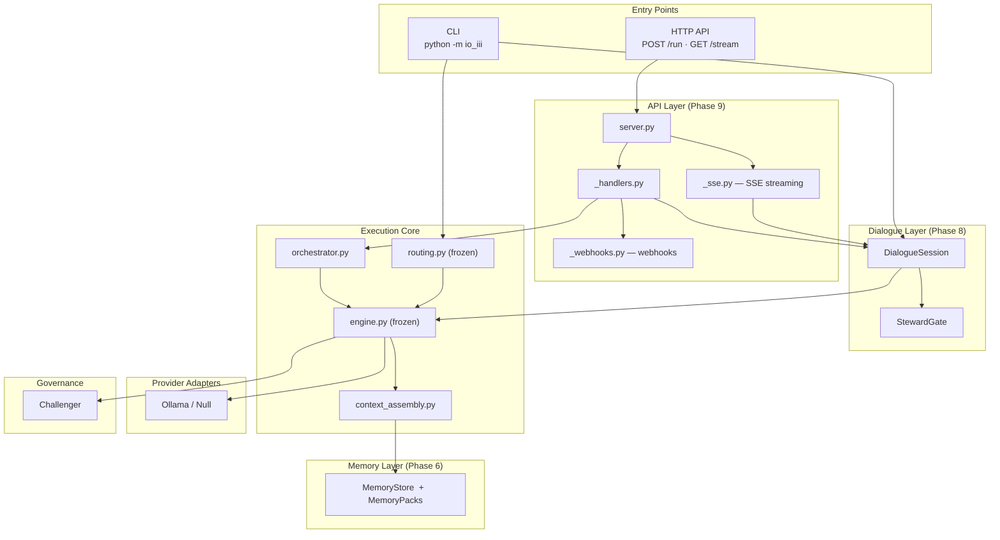
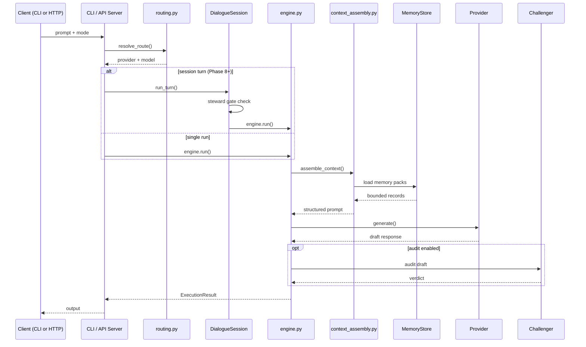
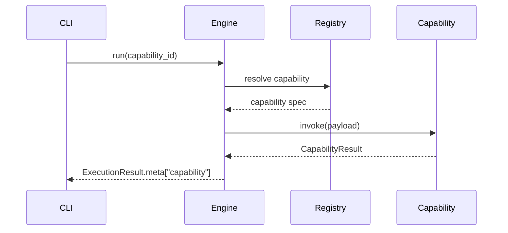

# IO-III — Governed LLM Runtime

IO-III is a Python runtime that wraps a local language model in a structured governance layer. Rather than calling a model directly, every request passes through deterministic routing, bounded execution controls, an optional audit gate, and a human-supervised session layer — before any output reaches the user.

Built over nine design phases. All phases complete. Latest stable tag: `v0.9.0`.

---

## What This Is

Most LLM tooling is permissive by default: you send a prompt and get a response. IO-III is designed the other way around. Execution limits are hard-coded. Content boundaries are enforced at every layer. Every structural decision is documented in an Architecture Decision Record before any code is written.

The result is a runtime that knows what it will not do — and enforces that structurally, not conventionally.

**For engineers:** IO-III is a local, provider-agnostic LLM control plane. It implements deterministic routing, bounded orchestration, governed dialogue sessions, a content-safe HTTP API, and a steward supervision layer. The execution engine, routing layer, and telemetry are frozen after Phase 1 — subsequent phases add surface area without modifying the core.

**For those new to AI architecture:** Think of IO-III as a circuit breaker and audit log sitting between a user and a language model. The model does not decide what it responds to, when it stops, or what gets logged. The runtime governs all of that. The language model is just one component in a controlled pipeline.

---

## Architecture at a Glance

- **Deterministic routing** — every request resolves to exactly one provider via a static routing table; no dynamic model selection
- **Bounded execution** — hard limits on audit passes (1), revision passes (1), capability invocations, and session turn counts
- **Content-safe output** — prompts, model completions, and memory values never appear in logs, metadata, or API responses
- **ADR-first development** — every structural change requires an Architecture Decision Record before implementation begins
- **Frozen core** — `routing.py`, `engine.py`, and `telemetry.py` do not change after Phase 1; all later phases add surface area only
- **Steward supervision** — sessions can run in work mode (autonomous) or steward mode (human approval required at configurable gates)
- **Transport adapter API** — the HTTP layer routes to the existing session and engine layer; it adds no new execution semantics

---

## Project Status

| **Phase** | **Description** | **Status** | **Tag** |
| --- | --- | --- | --- |
| 1 | Control Plane | **Complete** | — |
| 2 | Structural Consolidation | **Complete** | — |
| 3 | Capability Layer | **Complete** | — |
| 4 | Context Architecture Formalisation | **Complete** | `v0.4.0` |
| 5 | Runtime Observability & Optimisation | **Complete** | `v0.5.0` |
| 6 | Memory Architecture | **Complete** | `v0.6.0` |
| 7 | Open-Source Initialisation Layer | **Complete** | `v0.7.0` |
| 8 | Governed Dialogue Layer | **Complete** | `v0.8.0` |
| 9 | API & Integration Surface | **Complete** | `v0.9.0` |

26 Architecture Decision Records. 1008 passing tests.

---

## System Layer Architecture



---

## Request Lifecycle



---

## Architecture Principles

**Determinism First**
Routing and execution behaviour must be predictable and reproducible. No dynamic routing, no output-driven model selection, no autonomous behaviour.

**Bounded Execution**
Every control flow has explicit limits: audit passes, revision passes, capability invocations, session turn counts. The system structurally rejects recursive or unbounded execution paths.

**Architecture Before Implementation**
Any change affecting control-plane design, routing logic, provider selection, audit behaviour, memory, or persistence requires a new ADR inside `ADR/` before implementation begins.

**Governance by Design**
Runtime constraints — audit limits, routing discipline, content-safe output, steward gate thresholds — are enforced structurally in code, not through convention or documentation.

**Minimal Reference Implementation**
The Python runtime demonstrates boundary discipline and deterministic structure. It is not an orchestration framework, agent system, or production deployment platform.

---

## Non-Goals

IO-III is explicitly **not**:

- an agent framework or autonomous reasoning pipeline
- a dynamic tool orchestrator or workflow engine
- a retrieval or embedding-based search system
- a multi-model arbitration system
- a cloud deployment platform or SaaS runtime

These exclusions are structural. The ADR record governs what has been ruled out and why.

---

## Core Invariants

Enforced by the test suite and invariant validator, not by convention:

- deterministic routing only — no output-driven fallback
- challenger enforcement is internal to the engine
- audit execution requires explicit user opt-in (`--audit`)
- bounded audit passes: `MAX_AUDIT_PASSES = 1`
- bounded revision passes: `MAX_REVISION_PASSES = 1`
- no recursion, no multi-pass execution chains
- single unified final output surface
- no prompt text, model output, or memory values in any log field or metadata record

---

## Governance Model

All structural changes follow an ADR-first development model.

Any modification affecting:

- control-plane design
- routing logic or fallback policy
- provider or model selection
- audit gate behaviour
- persona binding or runtime governance
- memory or persistence layers
- API surface or integration contracts

requires a new Architecture Decision Record inside `ADR/` before implementation begins.

The repository is the source of truth for IO-III architectural boundaries.

---

## Python Module Architecture

```mermaid
flowchart LR
    subgraph API["api/"]
        APISERVER["server.py"]
        APIH["_handlers.py"]
        APISSE["_sse.py"]
        APIWH["_webhooks.py"]
    end
    subgraph CLI["cli/"]
        CLIMAIN["__init__.py"]
        CLISESS["_session_shell.py"]
    end
    subgraph Core["core/"]
        ENGINE["engine.py"]
        DIALOGUE["dialogue_session.py"]
        SMODE["session_mode.py"]
        ORCH["orchestrator.py"]
        ASSEMBLY["context_assembly.py"]
        TELEMETRY["telemetry.py"]
    end
    subgraph Memory["memory/"]
        MEMSTORE["store.py"]
        MEMPACKS["packs.py"]
        MEMPOL["policy.py"]
    end
    subgraph Routing[""]
        ROUTING["routing.py"]
    end
    subgraph Providers["providers/"]
        OLLAMA["ollama_provider.py"]
        NULL["null_provider.py"]
    end
    APISERVER --> APIH
    APISERVER --> APISSE
    APIH --> ORCH
    APIH --> DIALOGUE
    APIH --> APIWH
    CLIMAIN --> CLISESS
    CLIMAIN --> ENGINE
    CLIMAIN --> ROUTING
    CLISESS --> DIALOGUE
    DIALOGUE --> SMODE
    DIALOGUE --> ENGINE
    ORCH --> ROUTING
    ORCH --> ENGINE
    ENGINE --> ASSEMBLY
    ENGINE --> OLLAMA
    ENGINE --> NULL
    ASSEMBLY --> MEMSTORE
    ASSEMBLY --> MEMPACKS
    MEMPACKS --> MEMPOL
```

---

## Control-Plane Reference

Two parallel surfaces: the CLI (direct execution) and the HTTP API (transport adapter to the same execution layer).

Execution path:

`CLI / API → routing.py → engine.run() → ExecutionContext → context_assembly → Provider → Challenger (optional)`

For multi-turn sessions:

`CLI / API → DialogueSession → StewardGate → engine.run() → ...`

Core modules:

| Module | Responsibility | Phase |
| --- | --- | --- |
| `config.py` | runtime config loading | 1 |
| `routing.py` | deterministic route resolution — **frozen** | 1 |
| `core/engine.py` | execution engine — **frozen** | 1 |
| `core/session_state.py` | control-plane state container | 1 |
| `core/execution_context.py` | engine-local runtime container | 2 |
| `core/context_assembly.py` | context assembly (ADR-010) | 2 |
| `core/failure_model.py` | structured failure semantics (ADR-013) | 3 |
| `core/orchestrator.py` | runbook orchestration layer | 4 |
| `core/runbook.py` | runbook schema and validation | 4 |
| `core/runbook_runner.py` | bounded step execution with checkpoint | 4 |
| `core/replay_resume.py` | deterministic replay and resume (ADR-020) | 4 |
| `core/preflight.py` | token pre-flight estimator (M5.1) | 5 |
| `core/telemetry.py` | execution telemetry metrics — **frozen** | 5 |
| `core/constellation.py` | constellation integrity guard (M5.3) | 5 |
| `memory/store.py` | atomic versioned memory record store | 6 |
| `memory/packs.py` | named memory bundle resolution | 6 |
| `memory/policy.py` | retrieval policy and sensitivity gating | 6 |
| `core/portability.py` | portability validation pass (M7.4) | 7 |
| `core/dialogue_session.py` | governed multi-turn session (ADR-024) | 8 |
| `core/session_mode.py` | work/steward mode + StewardGate | 8 |
| `core/snapshot.py` | session snapshot export/import (M6.7/M8.3) | 8 |
| `api/server.py` | HTTP server and path routing (stdlib) | 9 |
| `api/app.py` | FastAPI application (alternative transport layer) | 9 |
| `api/_handlers.py` | request handlers — transport adapter only | 9 |
| `api/_sse.py` | Server-Sent Events streaming | 9 |
| `api/_webhooks.py` | best-effort webhook dispatcher | 9 |
| `providers/ollama_provider.py` | Ollama provider adapter | 1 |
| `providers/null_provider.py` | null provider (test/offline) | 1 |

---

## Quick Start

**Prerequisites:** [Ollama](https://ollama.com) running locally with at least one model pulled (e.g. `ollama pull qwen2.5:14b-instruct`). Python 3.11+.

**Setup:**

```bash
git clone https://github.com/CevenJKnowles/io-architecture.git
cd io-architecture
python -m venv .venv
source .venv/bin/activate      # Windows: .venv\Scripts\activate
pip install -e ".[dev]"
```

**Single run:**

```bash
python -m io_iii run executor --prompt "Explain deterministic routing in one sentence."
```

**Multi-turn session:**

```bash
python -m io_iii session start --mode work
# copy the session_id UUID from the output, then:
python -m io_iii session continue --session-id <uuid> --prompt "Next question."
```

**Web UI (self-hosted chat interface):**

```bash
python -m io_iii serve                        # binds to 127.0.0.1:8080 by default
python -m io_iii serve --host 0.0.0.0 --port 9000   # custom bind
```

Open `http://127.0.0.1:8080` in a browser. You will see a chat interface where you type prompts and receive responses as conversation bubbles.

To enable model responses in the web UI, ensure `runtime.yaml` contains:

```yaml
content_release: true   # ADR-026 — operator opt-in to surface model output
```

What happens on `run`:

1. CLI loads runtime configuration from `architecture/runtime/config/`
2. `routing.py` resolves exactly one provider + model via the routing table
3. `engine.run()` builds an `ExecutionContext`, assembles context (including any memory packs), and calls the provider
4. The challenger optionally audits the draft (if `--audit` is supplied)
5. A content-safe `ExecutionResult` is returned to the output surface

---

## Architecture Validation

Invariant validator:

```bash
python architecture/runtime/scripts/validate_invariants.py
```

Full test suite:

```bash
pytest
```

Capability listing:

```bash
python -m io_iii capabilities --json
```

---

## Capability Invocation

Capabilities are bounded runtime extensions introduced in Phase 3. They are deterministic, explicitly invoked, registry-controlled, and single-execution only.

| **Capabilities are** | **They do not introduce** |
| --- | --- |
| explicitly invoked | autonomous behaviour |
| registry-controlled | dynamic tool selection |
| single-execution only | recursive execution |
| payload-bounded | workflow orchestration |
| output-bounded | multi-step agent loops |



---

## Documentation Structure

```text
ADR/            26 architectural decision records (ADR-001 through ADR-026)

docs/
  overview/     high-level system documentation (DOC-OVW-*)
  architecture/ phase guides and architecture definitions (DOC-ARCH-*)
  governance/   governance rules and lifecycle policies (DOC-GOV-*)
  runtime/      runtime metadata and execution contracts (DOC-RUN-*)
```

Primary entry points:

```text
docs/overview/DOC-OVW-001-architecture-overview-index.md
docs/architecture/DOC-ARCH-001-io-iii-llm-architecture.md
docs/architecture/DOC-ARCH-003-io-iii-master-project-roadmap.md
```

---

## Repository Layout

```text
ADR/                        architectural decision records (ADR-001–026)

docs/
  overview/                 high-level system documentation
  architecture/             phase guides and architecture definitions
  governance/               governance rules and lifecycle policies
  runtime/                  runtime metadata and execution contracts

architecture/
  runtime/
    config/                 canonical runtime configuration (YAML)
    tests/                  invariant fixtures
    scripts/                invariant validator

io_iii/                     reference runtime implementation
  api/                      HTTP transport layer (Phase 9)
    static/                 self-hosted web UI (index.html)
  capabilities/             bounded capability registry (Phase 3)
  cli/                      CLI entry points and subcommands
  core/                     engine, session, orchestration, telemetry
  memory/                   memory store, packs, retrieval policy (Phase 6)
  providers/                provider adapters (Ollama, null)
  config.py                 runtime config loader
  routing.py                deterministic route resolution (frozen)

tests/                      test suite (1046 tests)
```

---

## Milestones

### Phase 1 — Control Plane Stabilisation

- deterministic routing (ADR-002)
- challenger enforcement (ADR-008)
- bounded audit gate contract (ADR-009)
- invariant validation suite
- regression enforcement

### Phase 2 — Structural Consolidation

- `SessionState` v0 implemented
- execution engine extracted from CLI
- CLI-to-engine boundary established
- `ExecutionContext` introduced
- context assembly integrated (ADR-010)
- challenger ownership consolidated inside the engine
- provider injection seams implemented

### Phase 3 — Capability Layer

Bounded capability extensions introduced inside the execution engine. Deterministic, explicitly invoked, registry-controlled, single-execution only. No autonomous behaviour or dynamic routing introduced.

### Phase 4 — Context Architecture Formalisation

Bounded runbook execution with deterministic continuity semantics.

- run identity and immutable lineage (ADR-018)
- checkpoint persistence contracts (ADR-019)
- replay from checkpoint snapshot
- resume from first incomplete or failed step (ADR-020)
- `source_run_id` preserved for lineage traceability

Tag: `v0.4.0`. Governing document: `DOC-ARCH-012`.

### Phase 5 — Runtime Observability & Optimisation

Measurement and governance signals added to the runtime without expanding its execution surface. Phase 1–4 execution stack remains frozen throughout.

- **M5.1** Token pre-flight estimator — configurable context ceiling enforced before every provider call
- **M5.2** Execution telemetry — `ExecutionMetrics` dataclass; Ollama native token counts; content-safe projection to `metadata.jsonl`
- **M5.3** Constellation integrity guard — config-time validation; `CONSTELLATION_DRIFT` failure code

Tag: `v0.5.0`. Governing document: `DOC-ARCH-013`.

### Phase 6 — Memory Architecture

Governed, deterministic memory as a bounded input to context assembly. Execution stack frozen throughout. No retrieval autonomy, no dynamic routing.

- **M6.1** Memory store — atomic, scoped, versioned records
- **M6.2** Memory pack system — named bundles declared in `memory_packs.yaml`
- **M6.3** Memory retrieval policy — route and capability allowlists; sensitivity-gated access
- **M6.4** Memory injection — bounded injection via context assembly; budget-enforced
- **M6.5** Memory safety invariants — INV-005 enforces content-safe logging via invariant validator
- **M6.6** Memory write contract — user-confirmed atomic single-record write
- **M6.7** Session snapshot export/import — portable control-plane artefact

Tag: `v0.6.0`. Governing document: `DOC-ARCH-014`.

### Phase 7 — Open-Source Initialisation Layer

Runtime made self-initialising for external users. Clone → configure → run without modifying structural code.

- `python -m io_iii init` and `python -m io_iii validate` commands (M7.2, M7.4)
- neutral template files: `persona.yaml`, `chat_session.yaml` (M7.3)
- portability validation pass with `PORTABILITY_CHECK_FAILED` failure code (M7.4)
- Work Mode / Steward Mode ADR-024 — governance prerequisite for Phase 8 (M7.5)

Tag: `v0.7.0`. Governing document: `DOC-ARCH-015`.

### Phase 8 — Governed Dialogue Layer

Multi-turn session governance with human supervision capability. Engine stack unchanged throughout.

- **M8.1 + M8.4** Work mode and steward mode (`SessionMode`); `StewardGate` evaluating configurable thresholds; session pause state contract
- **M8.2 + M8.3** Session persistence (`save_session` / `load_session`); snapshot import/export wired to snapshot layer (M6.7)
- **M8.5** Session shell CLI — `session start`, `session continue`, `session status`, `session close`; structured exit code 3 for steward pause
- **M8.6** Dialogue session test suite — 916 tests passing at phase close

Tag: `v0.8.0`. Governing document: `DOC-ARCH-016`.

### Phase 9 — API & Integration Surface

Thin, content-safe HTTP surface wrapping the existing CLI and session layer. No new execution semantics. All Phase 1–8 invariants preserved. The API is a transport adapter only (ADR-025).

- **M9.0** ADR-025: transport adapter contract — endpoint-to-CLI mapping, content safety extension, SSE contract, webhook contract, structured exit codes, web UI contract
- **M9.1** HTTP API layer: `POST /run`, `POST /runbook`, `POST /session/start`, `POST /session/{id}/turn`, `GET /session/{id}/state`, `DELETE /session/{id}`
- **M9.2** Server-Sent Events on `GET /session/{id}/stream` — `turn_started`, `turn_output`, `turn_completed`, `steward_gate_triggered`, `turn_error`
- **M9.3** Webhook dispatcher — best-effort delivery on `SESSION_COMPLETE`, `RUNBOOK_COMPLETE`, `STEWARD_GATE_TRIGGERED`; content-safe payloads; silent failure
- **M9.4** CLI improvements — `--output json` flag formalised; `serve` subcommand; structured exit codes (0/1/2/3)
- **M9.5** Self-hosted web UI — single static HTML file; no external dependencies; clean chat interface with prompt/response bubbles; steward pause controls
- **ADR-026** Governed content release gate — `content_release: true` in `runtime.yaml` surfaces model output as a `response` field on `/run` and session turn responses; all other content-safety invariants (ADR-003) preserved; operator accepts responsibility for access control

Tag: `v0.9.0`. Governing document: `DOC-ARCH-017`.

---
