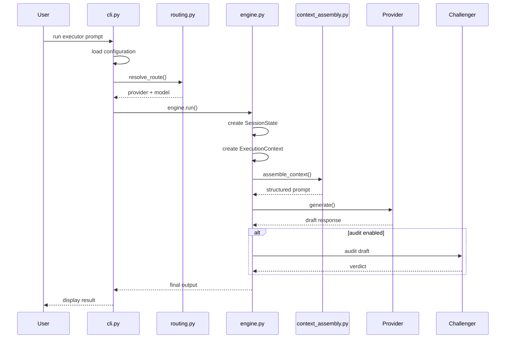
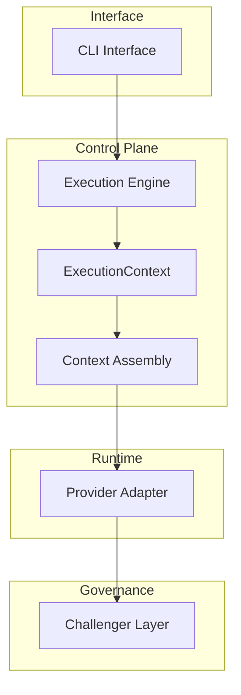
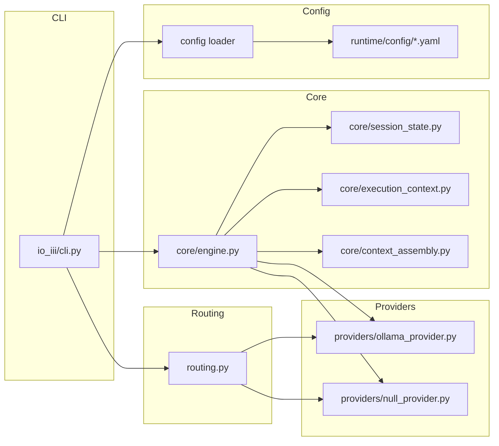
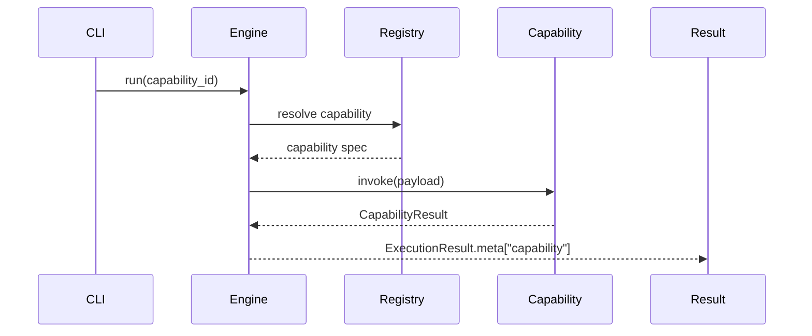

# IO-III Architecture

IO-III is a local LLM control-plane runtime: a Python layer that sits between you and a language model and governs how that interaction behaves. Where most LLM tooling is
permissive by default, IO-III is restrictive by design. Execution limits are hard-coded.
Content boundaries are enforced recursively at the logging level. Every significant
architectural decision is documented in an ADR before it is implemented. The system
knows what it will not do, and that refusal is structural rather than conventional.

Built over four design generations. Phase 4 complete. Phase 5 now active.
Latest stable phase tag: `v0.4.0`.

---

## Architecture Principles

IO-III follows a small set of architectural principles that guide all design decisions.

**Determinism First**
All routing and execution behaviour must be predictable and reproducible. No dynamic routing or autonomous behaviour is introduced.

**Bounded Execution**
All control flows have explicit limits (audit passes, revision passes, capability invocation). The system rejects recursive or unbounded execution paths.

**Architecture Before Implementation**
Structural changes require an Architecture Decision Record (ADR) before code changes.

**Governance by Design**
Operational constraints (audit limits, routing discipline, invariants) are enforced structurally in the runtime rather than through convention.

**Minimal Reference Implementation**
The Python runtime intentionally demonstrates the architecture without expanding into a full orchestration framework.

---

## Project Status

| **Phase** | **Description**  | **Status** |
|---|---|---|
| 1 | Control Plane | Stabilised |
| 2 | Structural Consolidation  | Complete |
| 3 | Capability Layer | Complete  |
| 4 | Context Architecture Formalisation  | Complete |
| **5** | **Runtime Observability & Optimisation**  | **Active** |
| *6* | *Memory Architecture* | *Planned* |

IO-III prioritises **determinism, governance discipline, and architectural clarity** over
feature velocity.

---

## Why This Architecture Matters

Most local LLM projects optimise for capability breadth.

IO-III treats runtime governance as the primary systems problem: deterministic routing, bounded execution, explicit failure semantics, immutable lineage, and recoverable continuity.

The result is a runtime architecture that remains inspectable under failure, reproducible across milestones, and portable as a governed control-plane substrate.

```text
runbook → checkpoint → failure
                    ├── replay → step 0
                    └── resume → failed_step_index

---

## Structural Guarantees

Unlike feature-driven AI frameworks, IO-III focuses on structural guarantees:
- deterministic routing
- bounded execution
- explicit audit gates
- invariant-protected runtime behaviour
- architecture-first governance

The repository contains:
1. a formal architecture specification layer (ADRs, invariants, contracts, governance rules)
2. a minimal reference implementation of the runtime control plane

---

## Non-Goals

IO-III is intentionally **not**:
- an agent framework
- a dynamic tool orchestrator
- a workflow engine
- an autonomous AI system
- a recursive reasoning pipeline

The runtime behaves as a **deterministic control-plane execution engine**. These
exclusions are structural, not conventional.

---

## Request Lifecycle



---

## System Layer Architecture



---

## Python Module Architecture



---

## Quick Run
```bash
python -m io_iii run executor --prompt "Explain deterministic routing in one sentence."
```
Expected behaviour:

- the CLI loads runtime configuration
- deterministic routing selects the provider
- the execution engine runs the prompt pipeline
- the challenger optionally audits the output (if enabled)

---

## Architecture Validation

Run the invariant validator:
```bash
python architecture/runtime/scripts/validate_invariants.py
```
Run the full test suite:
```bash
pytest
```
Both commands verify that the system satisfies its core architectural invariants.

---

## Capability Invocation (Phase 3)

Capabilities are introduced in Phase 3 as bounded runtime extensions.
|  **Capabilities are:** |  They do **not** introduce: |
|---|---|
|  - explicitly invoked |  - autonomous behaviour |
|  - registry-controlled |  - tool selection |
|  - single-execution only |  - recursive execution |
|  - payload-bounded |  - workflow orchestration |
|  - output-bounded |   |



---

## Core Invariants

IO-III enforces the following system-level guarantees:
- deterministic routing only
- challenger enforcement internal to the engine
- audit execution explicitly user-toggled
- bounded audit passes (`MAX_AUDIT_PASSES = 1`)
- bounded revision passes (`MAX_REVISION_PASSES = 1`)
- no recursion loops
- no multi-pass execution chains
- single unified final output

These are treated as contract-level invariants enforced by the test suite and invariant validator, not by convention.

---

## Governance Model

All structural changes follow an ADR-first development model.

Any modification affecting:
- control-plane design
- routing logic or fallback policy
- provider or model selection
- audit gate behaviour
- persona binding or runtime governance
- memory or persistence layers
- cross-model interaction

requires a new Architecture Decision Record inside `ADR/` before implementation begins.

The repository functions as the source of truth for IO-III architectural boundaries.

---

## Control-Plane Reference Implementation

The Python implementation is deliberately minimal. Its purpose is to demonstrate boundary
discipline and deterministic control-plane structure under governance constraints.

Core modules:
| Module | Responsibility |
|---|---|
| `config.py` | runtime config loading |
| `routing.py` | deterministic route resolution |
| `core/engine.py` | execution engine |
| `core/context_assembly.py` | context assembly (ADR-010) |
| `core/session_state.py` | control-plane state container |
| `core/execution_context.py` | engine-local runtime container |
| `providers/null_provider.py` | null provider adaptor |
| `providers/ollama_provider.py` | Ollama provider adaptor |
| `cli.py` | CLI entrypoint |

Execution path:

`CLI → Engine.run() → ExecutionContext → Context Assembly → Provider → Challenger (optional)`

---

## Documentation Structure

```
DOC-OVW   system overview documents
DOC-ARCH  architecture definitions
DOC-IMPL  implementation documentation
DOC-RUN   runtime configuration documentation
DOC-GOV   governance documentation
ADR       architectural decision records
```

Primary entry points:
```
docs/overview/DOC-OVW-001-architecture-overview-index.md
docs/architecture/DOC-ARCH-001-runtime-architecture.md
```

---

## Repository Layout

```
ADR/                       architecture decision records

docs/
  overview/                high-level system documentation
  architecture/            architecture definitions
  governance/              governance rules and lifecycle policies
  runtime/                 runtime metadata and execution contracts

architecture/
  runtime/
    config/                canonical runtime configuration
    tests/                 invariant fixtures
    scripts/               invariant validator

io_iii/                    reference runtime implementation
  core/                    engine components
  providers/               provider adapters
  routing.py               deterministic routing
  cli.py                   CLI interface
```

---

## Milestones

### Phase 1 - Control Plane Stabilisation

- deterministic routing
- challenger enforcement (ADR-008)
- bounded audit gate contract (ADR-009)
- invariant validation suite
- regression enforcement

### Phase 2 - Structural Consolidation

- SessionState v0 implemented
- execution engine extracted
- CLI to engine boundary established
- context assembly integrated (ADR-010)
- ExecutionContext introduced
- challenger ownership consolidated inside the engine
- provider injection seams implemented
- tests passing (pytest)
- invariant validator passing

### Phase 3 - Capability Layer

Bounded capability extensions introduced inside the execution engine. Capabilities remain
deterministic, explicitly invoked, registry-controlled, and single-execution only. No
autonomous behaviour or dynamic routing introduced.

### Phase 4 - Context Architecture Formalisation (Active)

Phase 4 extends bounded runbook execution into deterministic continuity semantics.

Implemented guarantees:

- run identity and immutable lineage
- checkpoint persistence contracts
- replay from checkpoint snapshot
- resume from first incomplete or failed step
- checkpoint integrity validation before execution
- new `run_id` per replay/resume invocation
- `source_run_id` preserved for lineage traceability

Execution continuity now remains bounded, deterministic, and structurally governed.

### Phase 5 - Workflow State Stewardship (Active)

Phase 5 formalises workflow-continuity semantics above run continuity.

The active objective is to elevate execution history into governed work-session state while preserving deterministic control-plane behaviour.

---
