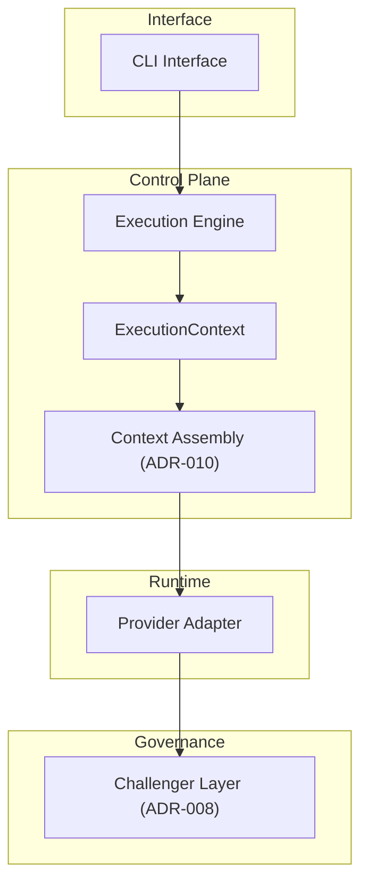
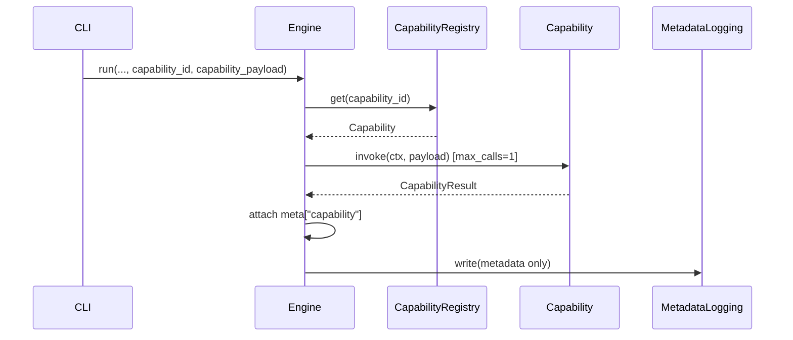

# IO-III Runtime Architecture

This document defines the **canonical runtime architecture** for IO-III.

The runtime implements a **deterministic control-plane execution model** with bounded execution and explicit governance constraints.

The architecture prioritises:
* deterministic routing
* bounded execution
* invariant enforcement
* governance-first system evolution

---

# Runtime Execution Flow

The IO-III runtime follows a strictly layered execution pipeline:
```
CLI
 ↓
Engine.run()
 ↓
ExecutionContext
 ↓
Context Assembly (ADR-010)
 ↓
Provider
 ↓
Challenger (optional)
```

Each layer has a **single responsibility**, preventing implicit behavior or uncontrolled execution paths.

---

# Runtime Architecture Diagram



This diagram illustrates the **deterministic execution pipeline** used by the IO-III control plane.

---

# Layer Responsibilities

## CLI Layer

The CLI provides the user-facing interface for executing IO-III tasks.

Responsibilities:
* load runtime configuration
* construct the initial session state
* pass execution parameters to the engine

The CLI must remain **thin and deterministic**.

---

## Execution Engine

The engine orchestrates runtime execution.

Responsibilities:

* manage execution flow
* enforce audit gate bounds
* invoke providers
* optionally invoke the challenger layer

The engine represents the **core runtime control plane**.

The challenger audit and revision inference paths are implemented as named helpers:

* `_do_challenger_pass()` — records the trace step, calls `challenger_fn`, emits
  `CHALLENGER_AUDIT_COMPLETE`, and returns the `audit_result` dict
* `_do_revision()` — constructs the revision prompt, records the trace step, calls
  `provider.generate()`, emits `REVISION_COMPLETE`, and returns the revised text

Bound enforcement (`MAX_AUDIT_PASSES`, `MAX_REVISION_PASSES`) and execution phase
tracking remain in `engine.run()` to preserve accurate failure classification.

---

## Capability Invocation

Capabilities are **explicit, single-shot runtime extensions**. They are invoked only when the caller provides:

- `capability_id`
- `capability_payload` (JSON)

There is **no automatic selection**, **no chaining**, and **no recursion**.

### Sequence (explicit capability invocation)



Key invariants:
- explicit ID only
- one invocation per `engine.run(...)`
- payload/output bounds enforced
- result captured in `ExecutionResult.meta["capability"]`

## ExecutionContext

ExecutionContext is an **engine-local runtime container**.

It encapsulates:
* runtime configuration
* session state
* provider selection
* assembled context metadata

ExecutionContext allows the engine to pass runtime data between layers without introducing implicit global state.

---

## Context Assembly (ADR-010)

Context Assembly constructs the structured prompt used by providers.

Responsibilities:
* integrate persona contract
* integrate user prompt
* attach routing metadata
* produce canonical prompt structure

This layer ensures **prompt structure remains deterministic and auditable**.

---

## Provider Layer

Provider adaptors interface with LLM runtimes.

Current providers:
* Ollama provider
* Null provider (testing / fallback)

Providers must implement deterministic input/output contracts.

---

## Challenger Layer

The challenger performs **optional bounded audit validation** of the provider output.

Constraints defined in ADR-009:
* maximum audit passes = 1
* maximum revision passes = 1

The challenger cannot trigger unbounded execution chains.

---

# Architectural Guarantees

The runtime architecture enforces several system-level guarantees:
* deterministic routing
* bounded execution
* invariant-protected runtime
* explicit audit control
* single final output

These guarantees are validated through invariant fixtures and regression tests.

---

# Relationship to Future Capability Layers

Future phases may introduce additional runtime capabilities including:
* verification modules
* memory persistence layers
* retrieval pipelines
* steward-mode orchestration

Any expansion must preserve:
* deterministic execution
* invariant enforcement
* bounded audit behavior

---

# Summary

IO-III implements a **governance-first LLM orchestration architecture** designed to remain predictable, auditable, and structurally stable as the system evolves.

The runtime architecture deliberately favours **explicit structure over implicit behaviour**, ensuring the system remains maintainable and safe as capabilities expand.